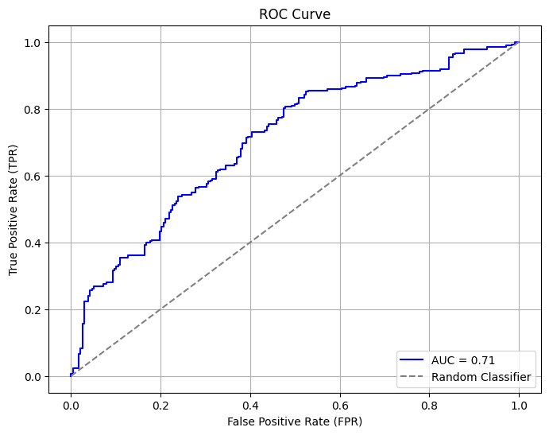

# Handling Imbalanced Datasets: ADASYN+NCL, SMOTE+Augmentation, vs Data Augmentation+Complex CNN

This project explores advanced methods for addressing the challenges posed by imbalanced datasets in machine learning. Three primary techniques are compared:

1. **ADASYN + Neighborhood Cleaning Rule (NCL)**
2. **SMOTE + Augmentation**
3. **Data Augmentation + Complex Convolutional Neural Networks (CNN)**

The results demonstrate the effectiveness of balancing techniques and models through performance metrics and visual analysis.

---

## Objective

To propose and evaluate methods for handling imbalanced datasets in classification tasks, focusing on optimizing performance and minimizing model complexity.

---

## Methods

### 1. **ADASYN + NCL**
   - **ADASYN**: Generates synthetic samples for the minority class, prioritizing areas where the decision boundary is unclear.
   - **NCL**: Cleans noisy or redundant samples from the majority class, ensuring a more balanced and clean dataset.
   - **Model Used**: Lightweight CNN.

### 2. **SMOTE + Augmentation**
   - **SMOTE**: Synthetic Minority Oversampling Technique generates synthetic samples by interpolating between existing minority class samples.
   - **Data Augmentation**: Applies transformations like rotation, flipping, and scaling to further enhance the dataset.
   - **Model Used**: Lightweight CNN.

### 3. **Data Augmentation + Complex CNN**
   - Augments the dataset by applying transformations like rotation, flipping, and scaling.
   - Uses a complex CNN architecture with millions of parameters to classify the data.

---

## Key Results

### 1. Confusion Matrices
   - **ADASYN + NCL**

     

     - True Negatives (Class 0): 232
     - False Positives: 6
     - False Negatives: 117
     - True Positives (Class 1): 151

   - **Data Augmentation + Complex CNN**

     

     - True Negatives (Class 0): 238
     - False Positives: 0
     - False Negatives: 268
     - True Positives (Class 1): 0

### 2. ROC Curves
   - **ADASYN + NCL**

     

     - **AUC**: 0.88

   - **Data Augmentation + Complex CNN**

     

     - **AUC**: 0.71

### 3. Model Complexity
   - **Comparison of Parameters**

     

     - **ADASYN + NCL**: Significantly fewer parameters compared to the complex CNN model, leading to faster training and inference.

---

## Conclusion

- **ADASYN + NCL** outperformed the Data Augmentation + Complex CNN method in terms of:
  - **Accuracy**: Better handling of minority classes.
  - **Efficiency**: Lower computational cost due to reduced model complexity.
  - **AUC**: Higher area under the curve, demonstrating superior performance.

- The **Complex CNN** method struggled with overfitting and required significantly more resources for training.

---

## Files and Resources

- **Notebooks**:
  - [ADASYN+NCL.ipynb](ADASYN+NCL.ipynb)
  - [SMOTE + Augmentation.ipynb](SMOTE+DATA_AUGMENTATION.ipynb)
  - [Comparing Methods.ipynb](comparing.ipynb)
  - [Complex CNN.ipynb](Data_Augmentation+CNN_Complex.ipynb)

- **Images**:
  - Confusion Matrices: `adasyn.png`, `cnn.png`
  - ROC Curves: `output.png`, `output2.png`
  - Parameter Comparison: `output3.png`

---

## Future Work

- Complete the analysis and add results for the **SMOTE + Augmentation** method.
- Investigate other synthetic data generation techniques (e.g., SMOTE variants).
- Explore lightweight deep learning architectures for faster processing.
- Integrate these methods into real-world applications such as medical diagnosis and predictive maintenance.

---

Feel free to reach out for collaboration or further discussions on balancing techniques and deep learning optimization!
